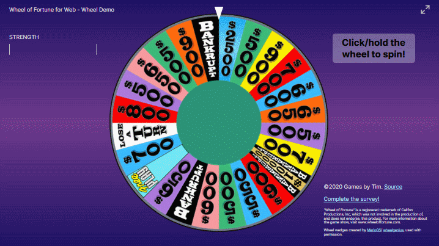

# Wheel of Fortune for Web - Wheel Demo

<a href="https://wheeldemo.gamesbytim.com"><strong>wheeldemo.gamesbytim.com</strong></a>

Here you'll find a tech demo of the wheel I intend to use for Wheel of Fortune for Web, the upcoming replacement for [Wheel of Fortune for PowerPoint](https://www.gamesbytim.com/2012/01/wheel-of-fortune.html).

Wheel of Fortune for PowerPoint's wheel took two clicks - one to spin, and one to stop. This wheel needs just one click, and hold it to charge the new strength meter!

### Advantages over the PowerPoint wheel

* More sense of control over the wheel (although the outcome's still completely random)
* Has inertia - will slow down as it spins
* Uses the [crypto-random API](https://developer.mozilla.org/en-US/docs/Web/API/Crypto/getRandomValues) to securely determine where the wheel stops
* Can programmatically tell what value the wheel landed at

## Survey

From January 20 to February 10, 2020, I ran a survey on the wheel demo to figure out how to further improve the wheel. [Click here for a summary of the survey results.](https://www.gamesbytim.com/2020/02/wheel-of-fortune-wheel-demo-survey.html)

## To Do

* Add multiple wheel types to choose from
* Add the wheel's second layer (wild card, Mystery wedge, etc)
* Add sound effects to the wheel

Note that I'm long ways away from releasing Wheel of Fortune for Web. I'm just sharing these types of demos in the meantime.

## License
Wheel of Fortune for Web - Wheel Demo is licensed under the GPL-3.0.

“Wheel of Fortune” is a registered trademark of Califon Productions, Inc, which was not involved in the production of, and does not endorse, this product. For more information about the game show, visit www.wheeloffortune.com.

Wheel wedges created by [MarioGS](http://buyavowel.boards.net/thread/6608/all-wheel-wedges)/[wheelgenius](https://wheelgenius.deviantart.com/), used with permission.